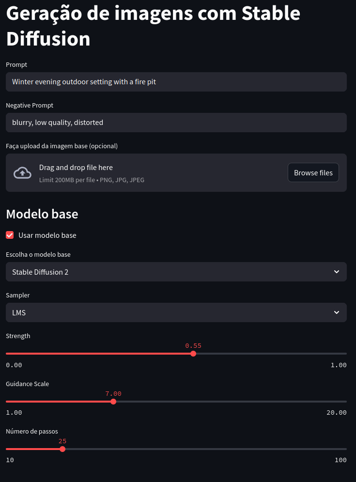
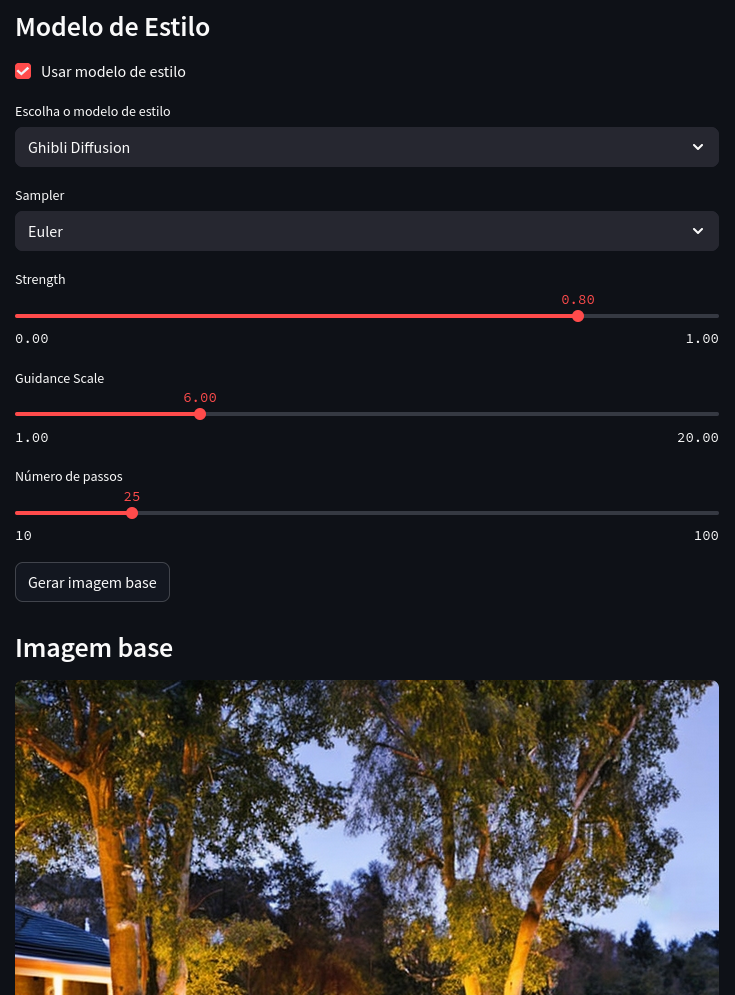

# 🎨 Geração de Imagens Artísticas com Stable Diffusion

Projeto de Mestrado - Visão Computacional  
Discente: Frankson Souza 

## 🧠 Sobre o Projeto

A geração automática de imagens artísticas e estilizadas a partir de **prompts textuais** e **imagens de estilo** vem se destacando como uma das aplicações mais populares da inteligência artificial generativa. Este projeto propõe a criação de uma **interface interativa** com **Streamlit**, integrando modelos de difusão como o **Stable Diffusion** e variações com *fine tuning*, para gerar imagens estilizadas a partir de:

- **Prompt textual**
- **Imagem de referência (opcional)**
- **Modelo de estilo artístico**

Essas técnicas se enquadram na **Redes Generativas**, com impacto relevante em áreas como design gráfico, entretenimento e educação.

## 🚀 Funcionalidades

- Geração de imagem com modelos base de Stable Diffusion
- Aplicação de estilos com modelos ajustados (Van Gogh, Ghibli, Pixar)
- Interface amigável via Streamlit
- Download direto das imagens geradas
- Suporte a aceleração com GPU via PyTorch

---

## 🛠️ Tecnologias Utilizadas

- Python 3.12+
- [Poetry](https://python-poetry.org/) (gerenciador de dependências)
- [Streamlit](https://streamlit.io/)
- [Diffusers (HuggingFace)](https://huggingface.co/docs/diffusers/index)
- PyTorch e CUDA
- PIL (Pillow) para manipulação de imagens

---

## 🧪 Requisitos

- Python 3.12+
- GPU com suporte a CUDA (opcional, mas recomendado)

---

## 📦 Instalação

1. **Clone o repositório:**

```bash
git clone https://github.com/seu-usuario/nome-do-projeto.git
cd nome-do-projeto
```

---

2. **Instale o Poetry:**

```bash
curl -sSL https://install.python-poetry.org | python3 -
```
---

3. **Instale as dependências:**

```bash
poetry install
```

---

4. **Ative o ambiente virtual:**

```bash
poetry shell
```

## ▶️ Como Rodar

Execute o aplicativo Streamlit com:
```
streamlit run app.py
```


## 📚 Modelos utilizados

### 🧩 Modelos base:

- [`stabilityai/stable-diffusion-2`](https://huggingface.co/stabilityai/stable-diffusion-2)
- [`CompVis/stable-diffusion-v1-4`](https://huggingface.co/CompVis/stable-diffusion-v1-4)

### 🎨 Modelos de estilo:

- [`dallinmackay/Van-Gogh-diffusion`](https://huggingface.co/dallinmackay/Van-Gogh-diffusion)
- [`nitrosocke/Ghibli-Diffusion`](https://huggingface.co/nitrosocke/Ghibli-Diffusion)
- [`lavaman131/cartoonify`](https://huggingface.co/lavaman131/cartoonify) — estilo Pixar/Disney


| Interface - Tela 1 | Interface - Tela 2 |
|--------------------|--------------------|
|  |  |


